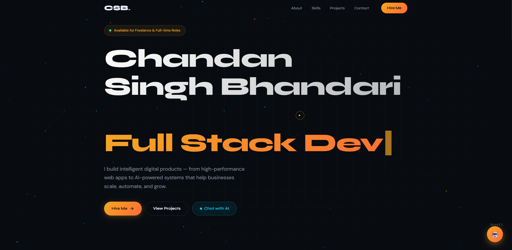

# 🚀 Chandan Singh Bhandari — Developer Portfolio

[](https://chandan-portfolio-indol-gamma.vercel.app/)


<p align="center">
  
</p>

A modern, AI-powered developer portfolio built to showcase projects, skills, and professional experience through an interactive and visually engaging experience.


-🤖 **AI Assistant:** Powered by Groq + Custom Knowledge Base  
-📂 **Backend API:** Node.js + Express + MongoDB  
-🎨 **Frontend:** HTML, CSS, JavaScript  

---

## ✨ Features

### 🎯 Modern Developer Portfolio

* Responsive design for all devices
* Smooth animations and transitions
* Interactive sections and engaging UI
* Professional project showcase

### 🤖 AI Portfolio Assistant

* Powered by Groq LLM
* Answers questions about projects, skills, and experience
* Custom knowledge base for personalized responses
* Session-based conversation support

### 📊 Dynamic Project Showcase

* Featured projects section
* Detailed project descriptions
* Technology stack highlights
* Development roadmap and upcoming projects

### 📬 Contact System

* Contact form with backend integration
* MongoDB data storage
* Input validation and security measures
* Lead collection support

### 🔒 Production Ready

* Express Rate Limiting
* Helmet Security Headers
* CORS Protection
* Compression Middleware
* Environment Variable Support

---

## 🛠️ Tech Stack

### Frontend

* HTML5
* CSS3
* JavaScript (ES6+)
* Responsive Design
* Custom Animations

### Backend

* Node.js
* Express.js
* MongoDB
* Mongoose

### AI Integration

* Groq API
* Custom RAG-style Knowledge Retrieval
* Context-Aware Responses

### Deployment

* Vercel (Frontend)
* Render (Backend)
* MongoDB Atlas

---

## 📌 Featured Projects

### 🎓 SmartRoll AI

An AI-powered attendance management system designed to simplify classroom attendance tracking and student record management.

**Tech Stack:** Streamlit, Python, HTML, OpenCV, Dlib, Librosa, Resymblyzer

---

### 🩺 Diabetes Prediction App

A machine learning web application that predicts diabetes risk based on health-related parameters.

**Tech Stack:** Python, Flask, Machine Learning

---

### 🎨 Neural Style Transfer (AdaIN) *(In Progress)*

A computer vision project implementing Adaptive Instance Normalization (AdaIN) for real-time artistic style transfer.

**Focus Areas:**

* Deep Learning
* Computer Vision
* PyTorch
* Neural Networks

---

### 🛒 Full Stack E-Commerce Platform *(Planned)*

A complete e-commerce solution featuring authentication, product management, cart functionality, payment integration, and admin dashboard.

**Planned Stack:**

* React
* Node.js
* Express
* MongoDB
* Stripe

---

## 🎯 Current Learning Goals

* Artificial Intelligence
* Computer Vision
* Deep Learning
* Full Stack Development
* System Design
* Scalable Web Applications

---

## 🚀 Getting Started

### Clone Repository

```bash
git clone https://github.com/chandansinghbhandari/My_portfolio.git
```

### Install Backend Dependencies

```bash
cd backend
npm install
```

### Configure Environment Variables

Create a `.env` file:

```env
PORT=5000

MONGODB_URI=your_mongodb_uri

GROQ_API_KEY=your_groq_api_key

CORS_ORIGIN=http://localhost:3000
```

### Run Development Server

```bash
npm start
```

---

## 📈 Future Improvements

* Voice-enabled AI Assistant
* Dark / Light Theme Switcher
* Project Analytics Dashboard
* Resume Download Tracking
* Blog Section
* AI-powered Project Recommendations

---

## 👨‍💻 About Me

I'm Chandan Singh Bhandari, a developer passionate about building practical software solutions using Full Stack Development and Artificial Intelligence.

I enjoy turning ideas into real products, exploring AI technologies, and continuously learning new tools and frameworks.

---

## 📬 Connect With Me

📧 Email: [bhandarichandan474@gmail.com](mailto:bhandarichandan474@gmail.com)

💼 LinkedIn: [Connect on LinkedIn](https://www.linkedin.com/in/chandan-singh-bhandari-91627a330/)

🐙 GitHub: [@chandansinghbhandari](https://github.com/chandansinghbhandari)

---

⭐ If you like this project, consider giving it a star!
